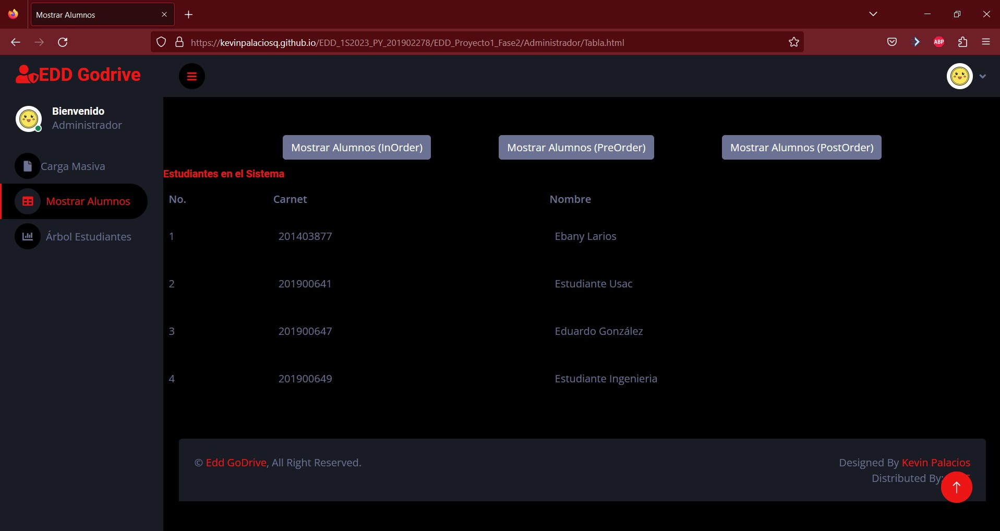
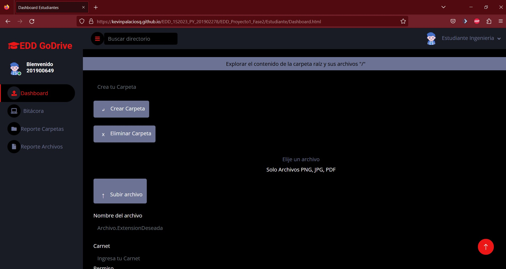

# 
Manual de Usuario

---
 ## Descripción
Para acceder a la página de Edd GoDrive debes acceder al siguiente [link](https://kevinpalaciosq.github.io/EDD_1S2023_PY_201902278/index.html).

Al acceder a Edd Godrive, serás redirigido al login, que se verá así:
 
Para Acceder como administrador deberas ingresar usuario y contraseña como "admin", así:

 

Serás Redirigido a la carga Masiva:

 

Luego deberás Cargar un archivo de extensión .json.

 

Al tener la carga masiva se verá de la siguiente forma.

 

Luego deberás desplazarte a la tabla de Estudiantes.

 

Luego deberás desplazarte al arbol de Estudiantes.

 

Al verificar que todo esta bien puedes cerrar sesión e iniciar como estudiante.

 

Ingresa como usuario .

 

Seras redirigido al Dashboard de Estudiantes.

 

Para poder crear una carpeta deberás posicionarte .
 
Al crear la carpeta ve a Bitácora.
 
También debes dirigirte al Reporte de carpetas.
 

Y así es como se usa la Interfaz de EDD Godrive.