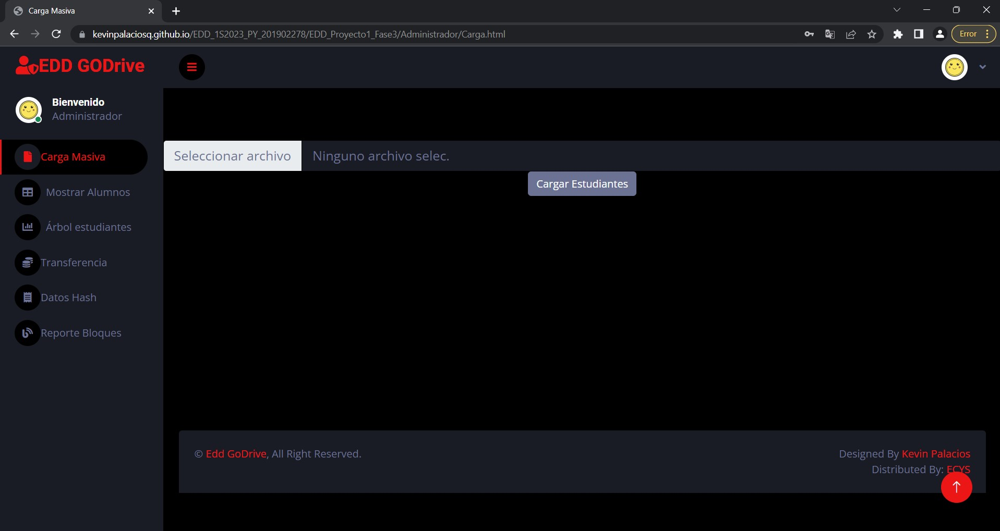
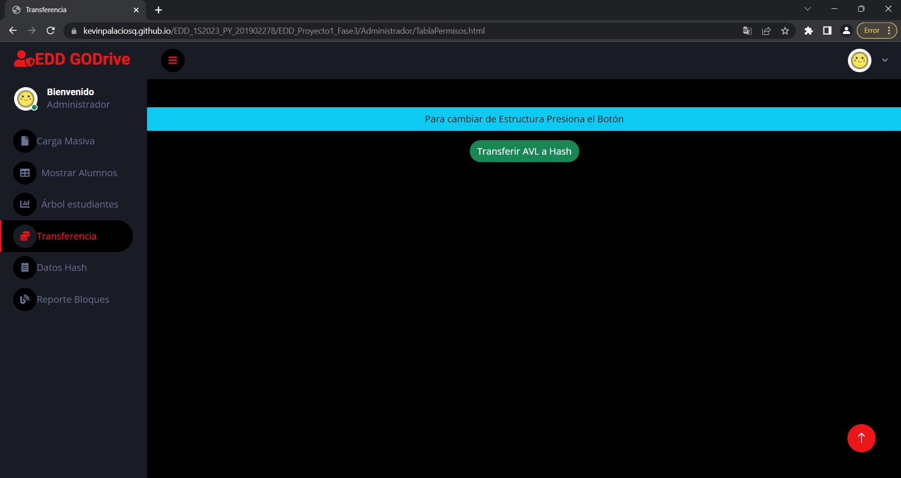
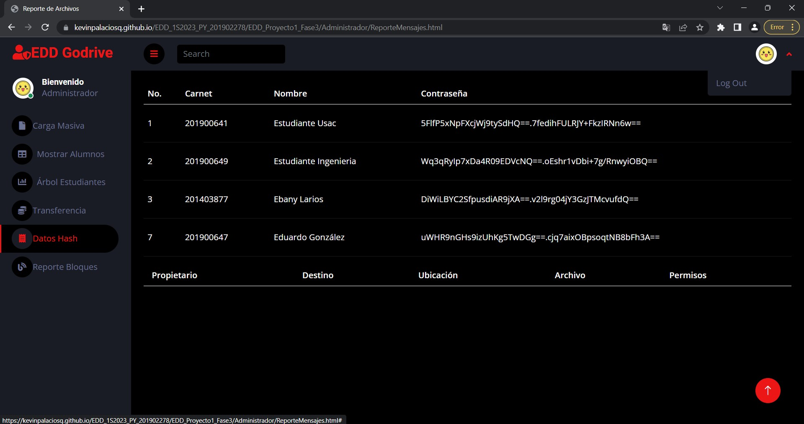
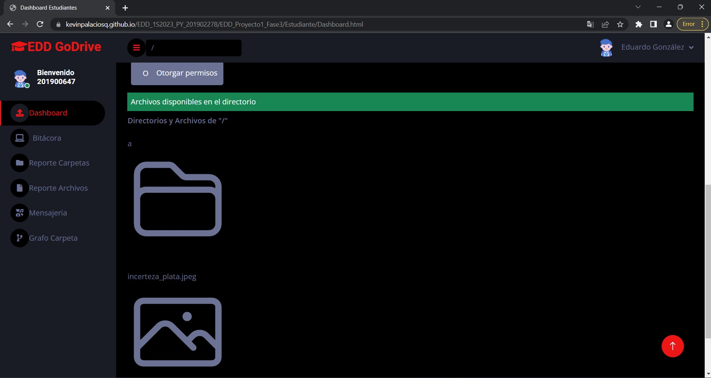
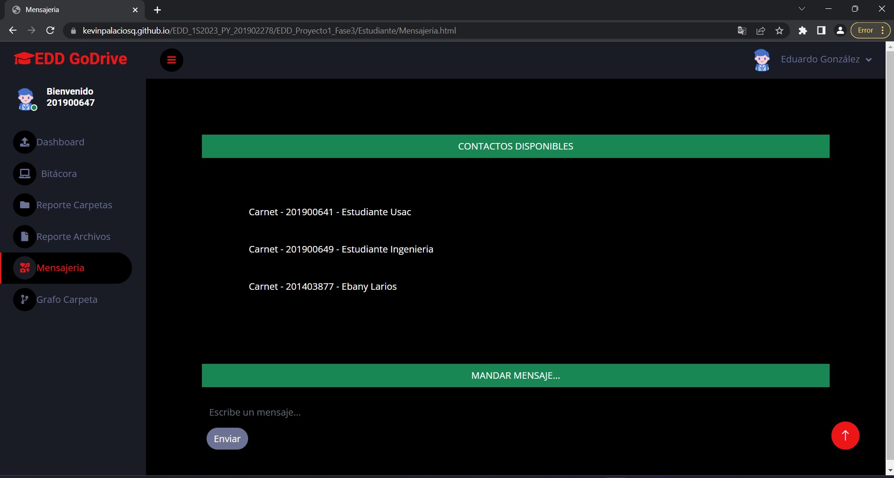
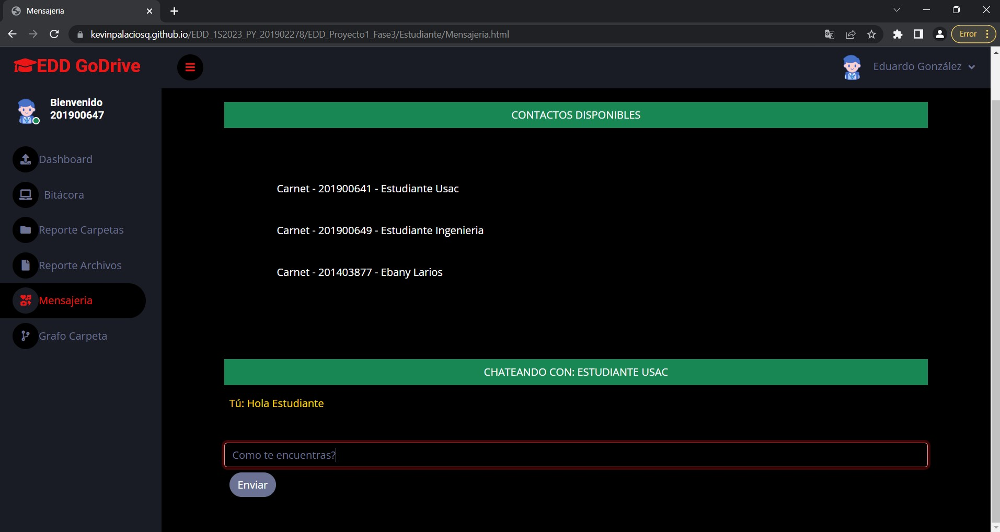
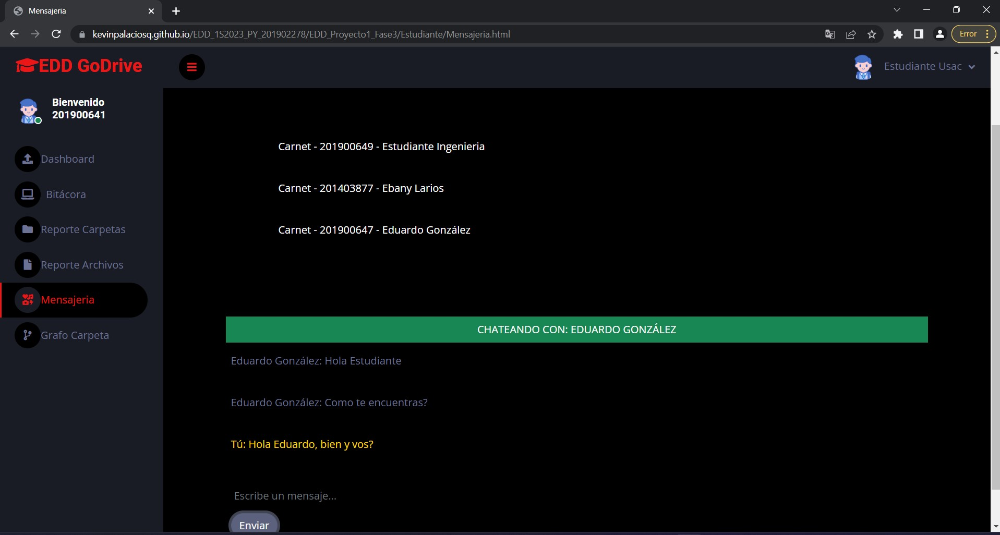
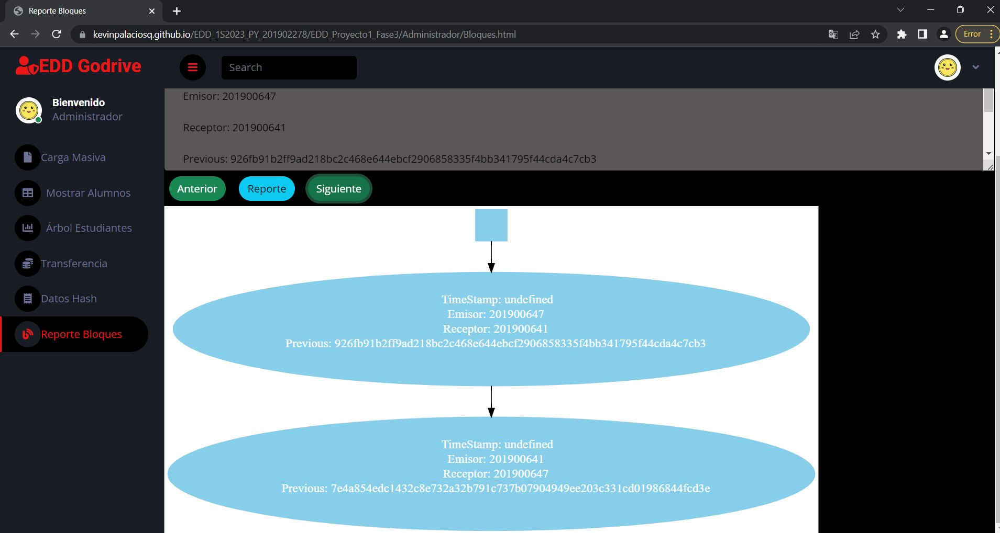

# 
Manual de Usuario

---
 ## Descripción
Para acceder a la página de Edd GoDrive debes acceder al siguiente [link](https://kevinpalaciosq.github.io/EDD_1S2023_PY_201902278/index.html).

Al acceder a Edd Godrive, serás redirigido al login, que se verá así:
 
Serás Redirigido a la carga Masiva:
 

Pero como en este caso estamos trabajando la fase 3 deberas trasladarte a :

 

Debido a que previamentese utilizó el local Storage deberás clickear el Botón de Transferir AVL a Hash, al hacerlo dirigete a:.

 

Como puedes ver se transfirieron los datos del Arbol AVL a la Tabla hash, ahora Cierra Sesión y entra como Estudiante, así:.

 

Entra como estudiante.

 

Ahora es funcional la opción de otorgar permisos y cargar archivos.

 

Al verificar que todo esta bien puedes cerrar sesión e iniciar como estudiante.

 

Ingresa como usuario .

 

Lo siguiente a realizar es hacer uso de la mensajería.

 

Elije con quien quieres chatear presionando, al hacerlo envia un mensaje.
 
Si cierras sesión y entras como estudiante verás el mensaje que recibiste.
 
Luego entra como administrador y podrás ver el reporte de los Bloques de mensajes entre estudiantes.
 

Y así es como se usa la Interfaz de EDD Godrive Fase 3.